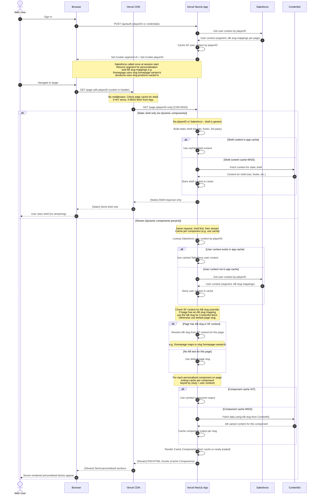

# Full-Page AB Testing via Contentful Slug URLs + Cache Components for Personalisation

No middleware and no variant routes. Salesforce user context includes AB slug mappings that tell the app which Contentful slug to fetch for each page under test. The app resolves the AB variant at the content layer by fetching a different Contentful slug per variant. Cache Components cache the output per slug so both variants are efficiently cached.

