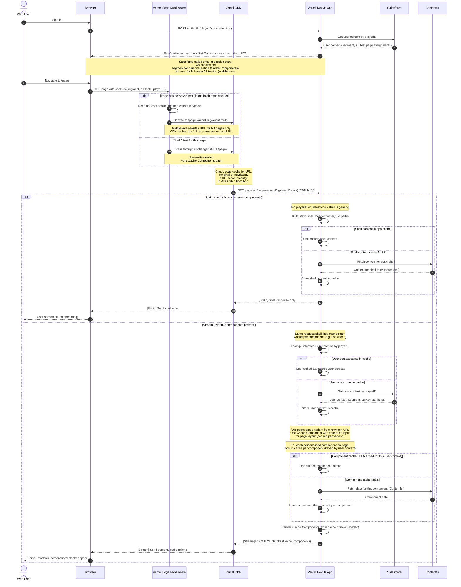

# Full-Page A/B Testing with Cache Components for Personalisation

```mermaid
sequenceDiagram
    autonumber
    actor U as Web User
    participant B as Browser
    participant MW as Vercel Edge Middleware
    participant CDN as Vercel CDN
    participant APP as Vercel NextJs App
    participant SF as Salesforce
    participant CF as Contentful

    %% --- One-off login ---
    U->>B: Sign in
    B->>APP: POST /api/auth (playerID or credentials)
    APP->>SF: Get user context by playerID
    SF-->>APP: User context (segment, AB test page assignments)
    APP-->>B: Set-Cookie segment=A + Set-Cookie ab-tests=encoded JSON
    Note over B,APP: Salesforce called once at session start.<br />Two cookies set:<br />segment for personalisation (Cache Components)<br />ab-tests for full-page AB testing (middleware)

    %% --- Page request with AB check ---
    U->>B: Navigate to /page
    B->>MW: GET /page with cookies (segment, ab-tests, playerID)

    alt Page has active AB test (found in ab-tests cookie)
        MW->>MW: Read ab-tests cookie and find variant for /page
        MW->>CDN: Rewrite to /page-variant-B (variant route)
        Note over MW,CDN: Middleware rewrites URL for AB pages only.<br />CDN caches the full response per variant URL.
    else No AB test for this page
        MW->>CDN: Pass through unchanged (GET /page)
        Note over MW,CDN: No rewrite needed.<br />Pure Cache Components path.
    end

    Note over CDN: Check edge cache for URL<br />(original or rewritten).<br />If HIT serve instantly.<br />If MISS fetch from App.
    CDN->>APP: GET /page or /page-variant-B (playerID only) [CDN MISS]

    alt Static shell only (no dynamic components)
        Note over APP: No playerID or Salesforce - shell is generic
        APP->>APP: Build static shell (header, footer, 3rd party)
        alt Shell content in app cache
            APP->>APP: Use cached shell content
        else Shell content cache MISS
            APP->>CF: Fetch content for static shell
            CF-->>APP: Content for shell (nav, footer, etc.)
            APP->>APP: Store shell content in cache
        end
        APP-->>CDN: [Static] Shell response only
        CDN-->>B: [Static] Send shell only
        B-->>U: User sees shell (no streaming)
    else Stream (dynamic components present)
        Note over APP: Same request: shell first, then stream<br />Cache per component (e.g. use cache)

        APP->>APP: Lookup Salesforce user context by playerID
        alt User context exists in cache
            APP->>APP: Use cached Salesforce user context
        else User context not in cache
            APP->>SF: Get user context by playerID
            SF-->>APP: User context (segment, ctxKey, attributes)
            APP->>APP: Store user context in cache
        end

        Note over APP: If AB page: parse variant from rewritten URL.<br />Use Cache Component with variant as input<br />for page layout (cached per variant).

        Note over APP: For each personalised component on page:<br />lookup cache per component (keyed by user context)
        alt Component cache HIT (cached for this user context)
            APP->>APP: Use cached component output
        else Component cache MISS
            APP->>CF: Fetch data for this component (Contentful)
            CF-->>APP: Component data
            APP->>APP: Load component, then cache it per component
        end
        APP->>APP: Render Cache Components (from cache or newly loaded)
        APP-->>CDN: [Stream] RSC/HTML chunks (Cache Components)
        CDN-->>B: [Stream] Send personalised sections
        B-->>U: Server-rendered personalised blocks appear
    end
```
