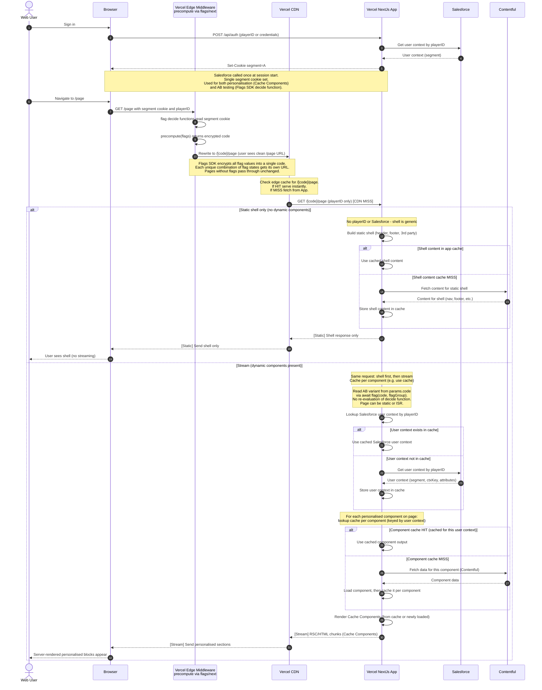

# Full-Page AB Testing with Vercel Flags SDK + Cache Components for Personalisation

Vercel Flags SDK replaces the manual cookie-based AB routing with its **precompute pattern**. Flags are defined in code via `flag()` from `flags/next`. The `decide` function reads the segment cookie (set at login by Salesforce) to choose the variant. Middleware calls `precompute()` which evaluates all flags and encodes the results into an encrypted URL segment. The page reads the precomputed code from `params.code` without re-evaluating flags, so it can stay static or use ISR.

Only one cookie is needed: the **segment cookie** serves both personalisation (Cache Components) and AB testing (Flags SDK).

