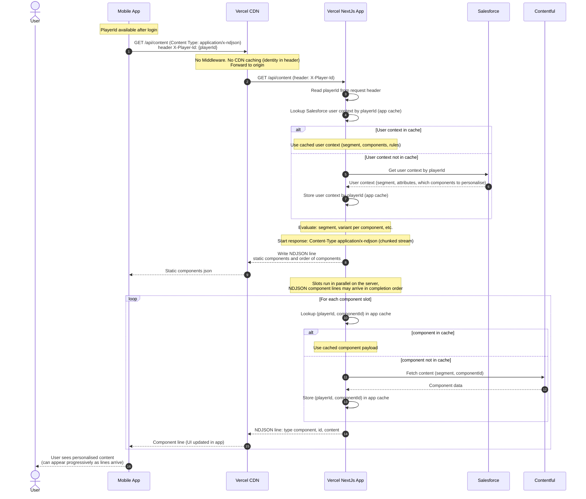

# Mobile API: NDJSON streaming — playerId → Salesforce → per-component cache

Same BFF pattern as the [single JSON mobile sequence](./mobile-api-playerid-salesforce-sequence.md), but the response is **`application/x-ndjson`**: one JSON object per line, chunked over one HTTP response. Mobile can **parse lines as they arrive** and update the UI progressively. **Salesforce** is still used only on the server for user context (cached by `playerId`); **Contentful** (or CMS) backs each component on cache miss.

**Typical line order (conceptual):** `order` (static layout order) → `meta` (segment, user) → many `component` lines (may arrive in **completion order**, not layout order). Some implementations add a final `done` line; the diagram above stops after component lines as drawn.

**No CDN cache** for the full response (identity in header). App-side **`unstable_cache`** (or equivalent) remains: user context by `playerId`, component payload by `(playerId, componentId)`.

---

## Sequence diagram (NDJSON API flow)

**Flow:** Mobile sends `GET /api/...?format=ndjson` (or `Accept: application/x-ndjson`) with `X-Player-Id`. Next.js resolves **Salesforce user context** (cache hit/miss unchanged), evaluates segment/rules, then resolves **each component** in parallel; each time a component is ready, the server **appends one NDJSON line** to the stream. Mobile reads the stream incrementally.

---

## Developer guide: implement the NDJSON API in Next.js (App Router)

Handover notes for engineers implementing the flow in the sequence diagram above. A **reference implementation** (mock Salesforce + mock CMS, real streaming + `unstable_cache`) is in [`src/app/api/personalised-content/route.ts`](../src/app/api/personalised-content/route.ts); user-context caching helper: [`src/lib/salesforce.ts`](../src/lib/salesforce.ts) (`getSalesforceUserContextByPlayerIdCached`).

### API contract

| Item | Recommendation |
|------|----------------|
| **Method** | `GET` |
| **Identity** | Header **`X-Player-Id`** (or agreed name); normalise `x-player-id` / `X-Player-Id` |
| **NDJSON opt-in** | Query **`?format=ndjson`** and/or **`Accept: application/x-ndjson`** |
| **Success body** | `Content-Type: application/x-ndjson`; **UTF-8** text; **one JSON object per line**, each line ends with **`\n`** |
| **Personalised response** | **`Cache-Control: private, no-store`** (same URL for all users; identity is only in header—not a CDN cache candidate as-is) |
| **Errors before stream** | Missing / unknown `playerId`: return **`Response.json({ error }, { status: 400 \| 404 })`**—never start a stream, so clients can always parse errors as JSON |

### Line types (suggested schema)

Align names with the diagram and your mobile parser:

1. **`order`** — Static screen order: e.g. `{ "type": "order", "componentIds": ["hero", "promo", ...] }`. Lets the app allocate slots before payloads arrive.
2. **`meta`** — User/segment summary from Salesforce-backed context: e.g. `{ "type": "meta", "segment": "A", "user": { "name", "email" } }`.
3. **`component`** — One per slot: `{ "type": "component", "id": "hero", "content": { ... } }`. **Arrival order** may differ from `order.componentIds` if the server resolves slots in parallel.
4. **`done`** *(optional but useful)* — `{ "type": "done" }` so the client can close loading state without relying only on connection close.

### Implementation steps (maps to the diagram)

1. **Create a Route Handler** — `app/api/<route>/route.ts`, export **`GET`** `async function GET(request: Request)`.

2. **Parse `playerId`** — From `request.headers`. If absent → **400** JSON.

3. **Load user context (Salesforce path)** — Call a function that internally uses **`unstable_cache`** keyed by **`playerId`**:
   - On **miss**: HTTP (or SDK) to Salesforce; persist rules/segment/component list needed for personalisation.
   - On **hit**: return cached context without calling Salesforce.
   - If unknown user → **404** JSON.
   - **Important:** define **`unstable_cache`** at **module scope** with **`playerId`** (and any other key inputs) **passed as arguments** to one shared inner `async` function. Avoid calling **`unstable_cache(...)(()`** from inside a helper that runs on every request and creates a **new** cache wrapper each time—Data Cache hits will usually not work as intended.

4. **Evaluate** — Pure app logic: which `componentId`s to load, variants, etc., from context (diagram “Evaluate”).

5. **Branch NDJSON vs JSON** — If the client asked for NDJSON, build a streamed response; else build a single `Response.json(...)`. Both branches should reuse the **same** cached loaders for each `(playerId, componentId)`.

6. **NDJSON stream** — `new Response(new ReadableStream({ async start(controller) { ... } }), { headers })`:
   - `const enc = new TextEncoder()`
   - **`controller.enqueue(enc.encode(JSON.stringify({ type: 'order', ... }) + '\n'))`**
   - Then **`meta`**
   - **`await Promise.all(componentIds.map(async (id) => { ... load via cached fn ...; controller.enqueue(component line) }))`**
   - Optionally **`done`** line
   - **`controller.close()`**; on failure **`controller.error(e)`**

7. **Per-component loading (Contentful path)** — Inside a **module-scoped** `unstable_cache(async (playerId, componentId) => { ... })`:
   - Use segment (and rules) from context; on miss call Contentful/CMS (or your BFF); store result in cache.
   - Include **`tags`** (e.g. `['personalised-content']`) if you need **`revalidateTag`** to invalidate user + components together.

8. **On-demand cache clear (optional)** — `export async function POST()` calling **`revalidateTag('your-tag', { expire: 0 })`** from **`next/cache`** for hard invalidation in dev/demo (Next 16: **`revalidateTag(tag, 'max')`** alone may not expire entries the way you expect).

### Mobile client expectations

- Use an HTTP API that exposes a **streaming body** (incremental read), not “wait for full response then parse”.
- Parse **line-by-line** (`split('\n')`, handle a trailing partial line buffer).
- Merge **`component`** lines into a map by **`id`**; **render / sort** using **`order.componentIds`**.

### Pitfalls

- Do not call **`revalidateTag`** inside **`unstable_cache`** callbacks or during unsupported phases—only from route handlers / server actions per Next.js docs.
- **`fetchCache`** on routes may conflict with **`cacheComponents`** in `next.config`; rely on **`unstable_cache`** for Data Cache in route handlers unless you validate segment config against your Next version.

---

## Summary vs single JSON response

| Aspect | Single JSON | NDJSON |
|--------|-------------|--------|
| **Salesforce** | Resolve user context by `playerId` (cached) | Same |
| **Evaluation** | Segment / rules in Next.js | Same |
| **Per component** | Cache `(playerId, componentId)`; CF on miss | Same |
| **Response shape** | One body after all work completes | Many lines; `component` lines as each slot completes |
| **Mobile UX** | Render after full JSON received | Optional progressive UI per line |
| **Layout order** | Keys in JSON object | Use first **`order`** line’s `componentIds`; merge payloads by `id` from **`component`** lines |

---

## Related

- **[Mobile API: playerId → Salesforce → per-component cache](./mobile-api-playerid-salesforce-sequence.md)** — non-streaming JSON variant.
- **Reference code:** [`src/app/api/personalised-content/route.ts`](../src/app/api/personalised-content/route.ts) — `GET` (JSON + NDJSON), `POST` cache clear; header `X-Player-Id`; query `?format=ndjson`.
