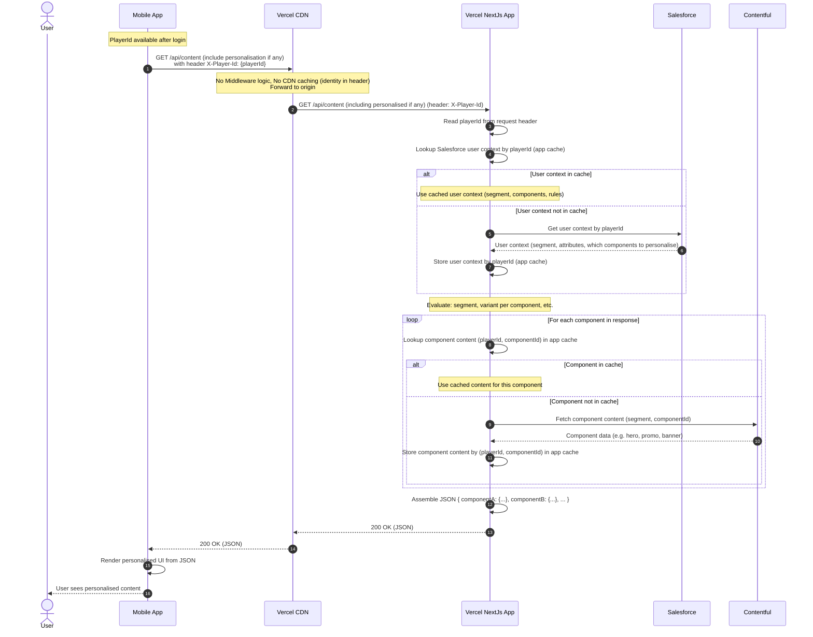

# Mobile API: playerId in headers → Salesforce → per-component cache

**Mobile sends only playerId (in headers). Next.js fetches Salesforce user context by playerId, caches it, evaluates personalisation, and returns JSON. Each component in the response is cached separately per user. No CDN caching** (identity is in the header).

In this flow **mobile does not call Salesforce or Contentful**. Mobile has playerId after login and sends it on every API request via a header (e.g. `X-Player-Id`). The Next.js app: (1) reads playerId from the header; (2) looks up **Salesforce user context** by playerId (use if cached, else call Salesforce and cache); (3) **evaluates** user context (segment, which components/variants) — all logic lives in Next.js; (4) for each component in the response, looks up **cache per (playerId, component)**; on cache MISS, fetches component data from **Contentful** (by segment + componentId), then caches it; (5) returns a single JSON payload. Mobile only renders the JSON.

**Note:** Response is **not CDN-cacheable** because the request URL is the same for all users and identity is in the header. Caching happens **inside the Next.js app** (Data Cache / `unstable_cache`): user context by playerId, and each component’s content by (playerId, componentId).

**Request path:** **Mobile → CDN → Next.js App** (every request hits the app when identity is in header).

---

## Sequence diagram (Mobile API flow)

**Flow:** Mobile sends e.g. `GET /api/personalised` (or `/api/mobile/dashboard`) with header `X-Player-Id: <playerId>`. Next.js reads playerId → lookup/cache Salesforce user context → evaluate → for each component, lookup/cache per (playerId, componentId) → return JSON. No CDN cache for the response.

---

## Summary

| Step | What happens |
|------|----------------|
| **Request** | Mobile sends one request (e.g. `GET /api/personalised`) with **playerId in header** (`X-Player-Id`). No variant or component list in URL. |
| **No CDN cache** | Because identity is in the header, the response is **not cacheable at CDN** by URL. Every request is forwarded to the Next.js app. |
| **User context** | API reads playerId from header → looks up **Salesforce user context** by playerId. If **in app cache** → use it; if **not** → call **Salesforce**, get context, **cache by playerId**. |
| **Evaluation** | Next.js **evaluates** user context (segment, which components, which variants). All personalisation logic lives in the app; mobile has none. |
| **Per-component cache** | For each component in the response, API looks up **cache by (playerId, componentId)**. On **HIT** → use cached content. On **MISS** → fetch component data from **Contentful** (segment + componentId), then **cache per (playerId, componentId)**. |
| **Response** | API returns a **single JSON** payload (e.g. `{ "hero": {...}, "promo": {...} }`). Mobile only renders; no SF calls, no evaluation. |
| **NDJSON (optional)** | Same `GET` with `?format=ndjson` or `Accept: application/x-ndjson` returns **`application/x-ndjson`**: first line **`order`** with static **`componentIds`** (screen order), then **`meta`**, then **`component`** lines (may arrive out of order), then **`done`**. Use `order.componentIds` to lay out UI; merge payloads by `id` from `component` lines. Still **`private, no-store`** at the CDN. |
| **Cache invalidation (demo)** | `POST /api/personalised-content` calls **`revalidateTag('personalised-content')`** so tagged `unstable_cache` entries (user context + components) are cleared on the next usage. |

---

## Difference from previous recommendation (variant in URL)

| Previous (variant in URL) | Current (playerId in header) |
|----------------------------|-------------------------------|
| Mobile called Salesforce at login; stored variant(s) locally | **Next.js** calls Salesforce; mobile never calls SF |
| Mobile had personalisation logic (which variant per component) | **Next.js** does all evaluation; mobile has no personalisation logic |
| API URL included variant (e.g. `?component=Y&variant=A1`) → **CDN cache** per URL | API URL is same for all; identity in header → **no CDN cache**; cache inside Next.js only |
| Cache key: variant (segment-level or per-component variant) | Cache key: **playerId** (user context) and **(playerId, componentId)** (per-component content) |

---

## Related docs

- **[Mobile API: NDJSON streaming](./mobile-api-ndjson-sequence.md)** — Same Salesforce + per-component cache story; response is newline-delimited JSON (`order`, `meta`, `component` lines, `done`) for progressive mobile UI.
- **[Scenario 13: playerID → Salesforce → Cache Components](./scenario-13-playerid-salesforce-cache-sequence.md)** — Web flow: playerID in cookie/header, static shell + streamed Cache Components.
- **[Mobile scenarios](/mobile)** — Scenario **“BFF — assembled personalised JSON”** (`/mobile/bff-personalised-json`) demos `GET /api/personalised-content` with `X-Player-Id` (optional NDJSON, cache clear). This doc matches that flow: playerId in header, Next.js owns SF + per-component cache.
