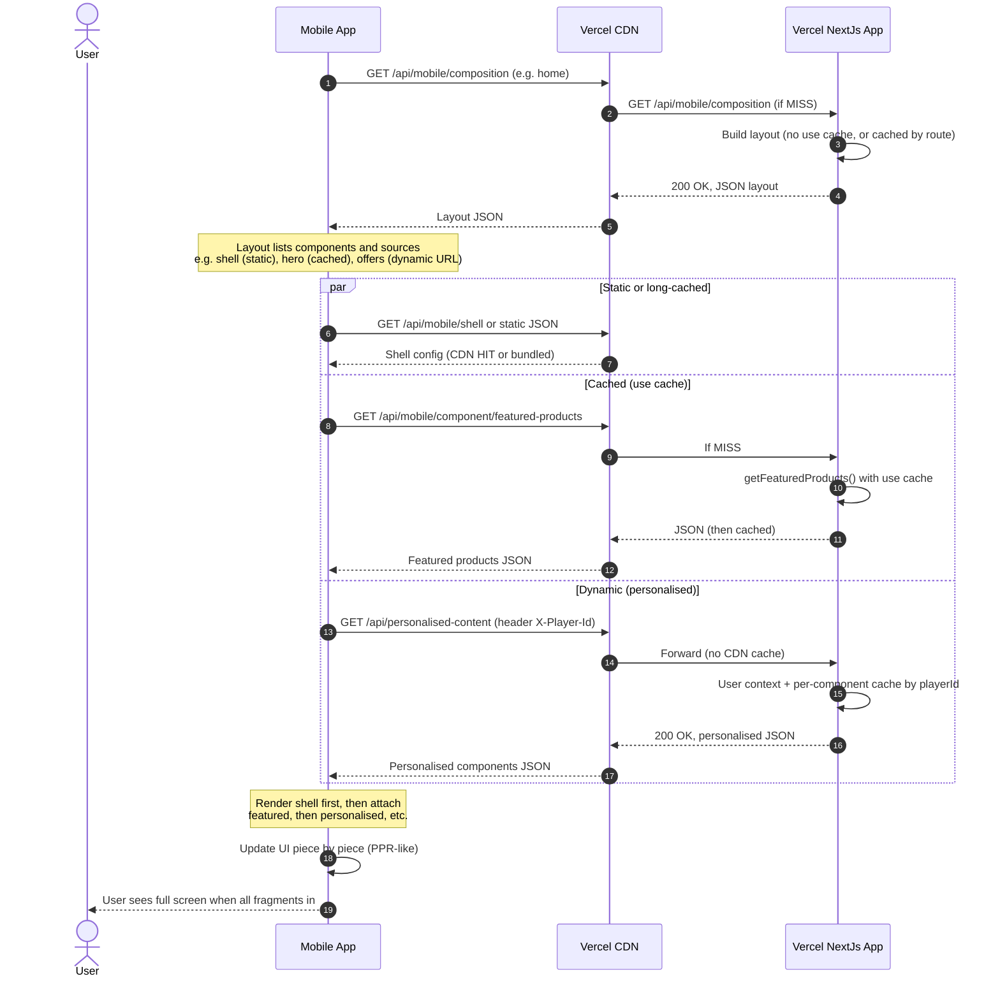
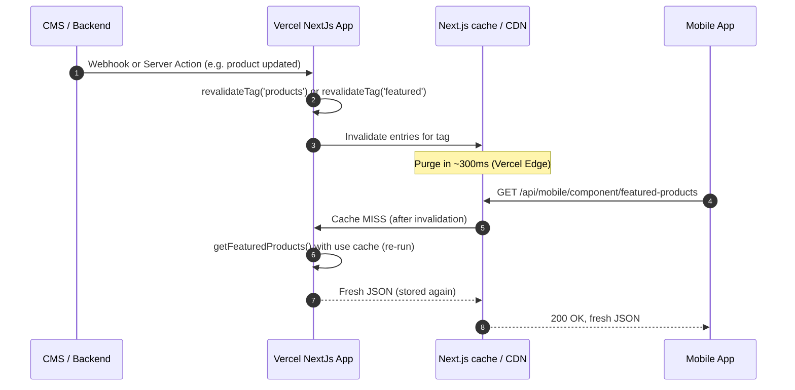

# Mobile SDUI + PPR equivalent: Composition, Cache Components, and Fragment pattern

This document captures an approach that aligns **native mobile apps** with Next.js 16’s **Cache Components** and **Partial Pre-rendering (PPR)** using **Server-Driven UI (SDUI)** and a **composition + fragment** pattern. The mental model shifts from "fetching data" to "fetching components."

---

## Summary of the proposal

| Concept | Web (Next.js 16) | Mobile equivalent |
|--------|-------------------|-------------------|
| **Shell** | Static HTML shell, CDN-cached | Static shell: hardcoded in app or fetched from JSON on Vercel with long max-age |
| **Cached parts** | RSC with `use cache` | Route Handlers that return JSON and use `use cache` (same cache engine) |
| **Dynamic parts** | Streamed RSC chunks | Non-cached endpoint or parallel request with identity (e.g. X-Player-Id) |
| **Composition** | Single response with static + streamed holes | **Composition endpoint**: returns a list of component IDs and their **data source URLs** (static, cached, or dynamic) |
| **PPR / streaming** | Shell first, then chunks fill in | **Fragment pattern**: mobile fetches layout JSON, then requests each component’s URL in parallel; UI updates as each response arrives. Alternatively: NDJSON streaming. |
| **Invalidation** | `revalidateTag()` | Same: use `revalidateTag()` in Route Handlers or webhooks; CDN purges in ~300ms |

The mobile app does not consume RSC payloads; it consumes **JSON** (component schema + data). The server can use the same **Cache Components** primitives (`use cache`, `cacheTag`, `cacheLife`) in API routes that return that JSON, so mobile benefits from the same cache engine and invalidation as the web.

---

## Thoughts on this mobile solution

- **Fits our current design:** We already have a single personalised endpoint that returns a JSON object keyed by component IDs (e.g. hero, promo, banner). The proposal generalises this into a **composition** endpoint that returns **which** components to show and **where** to get each one (URL or type: static / cached / dynamic). That allows mixing long-lived cached content (e.g. featured products with `use cache`) with per-user content (e.g. our playerId-based personalised components) in one screen.
- **Same cache stack:** Using `use cache` (and tags) in Route Handlers that serve JSON means mobile and web share the same caching and invalidation story. Updating a product or a campaign can trigger `revalidateTag()` and both web and mobile see fresh content without app-store releases.
- **PPR-like UX without RSC:** The **fragment pattern** (layout JSON → list of URLs → parallel fetches) gives a "shell first, then pieces fill in" behaviour without HTTP streaming. The app can show the static shell immediately and attach data to each slot as the corresponding request completes. NDJSON streaming is an alternative if the app can use a streaming HTTP client.
- **SDUI:** Treating the response as "components" (schema + data) rather than one monolithic payload matches how we already think about the personalised API (components keyed by ID). Extending that to a formal **component-based JSON schema** (type, layout, remote_source) makes it easier to add new blocks and A/B test layouts from the server.
- **Trade-off:** The fragment pattern increases the number of network requests (one composition + N component requests). That can be mitigated by batching (e.g. one "cached" endpoint that returns several cached components in one response) and by keeping the composition response small and cacheable where possible.

---

## Sequence diagram: Composition + Fragment pattern (PPR-like for mobile)

**Flow:** Mobile requests a **composition** (layout) that lists components and their source URLs. It then fetches **static shell** (cached or bundled), **cached components** (Route Handlers with `use cache`), and **dynamic/personalised** components (e.g. with X-Player-Id) in parallel. The UI updates as each fragment arrives.

---

## Sequence diagram: Cache invalidation (same as web)

**Flow:** When content changes (e.g. CMS or product update), a webhook or Server Action calls `revalidateTag()`. The Next.js cache (and CDN for cacheable routes) is purged; the next mobile request gets fresh JSON.

---

## Summary table: Web vs mobile equivalent

| Feature | Next.js 16 (Web) | Native mobile equivalent |
|--------|-------------------|---------------------------|
| **Directive** | `use cache` in RSC | Route Handlers that return JSON and use `use cache` |
| **PPR shell** | Sent via HTTP streaming (RSC) | Multi-part JSON or parallel fragment fetches |
| **Tags** | `cacheTag('slug')` | Same tags in API Route Handlers |
| **Invalidation** | `revalidateTag()` | Call `revalidateTag()` via webhook or Server Action to purge CDN / cache |
| **Composition** | Single document with static + streamed holes | Composition endpoint returns list of component IDs and their source URLs (static, cached, dynamic) |

---

## Related docs

- **[Mobile API: playerId in headers → Salesforce → per-component cache](./mobile-api-playerid-salesforce-sequence.md)** — Single personalised endpoint; same app cache and per-component caching idea.
- **[Scenario 13: playerID → Salesforce → Cache Components](./scenario-13-playerid-salesforce-cache-sequence.md)** — Web flow with playerID and Cache Components.
