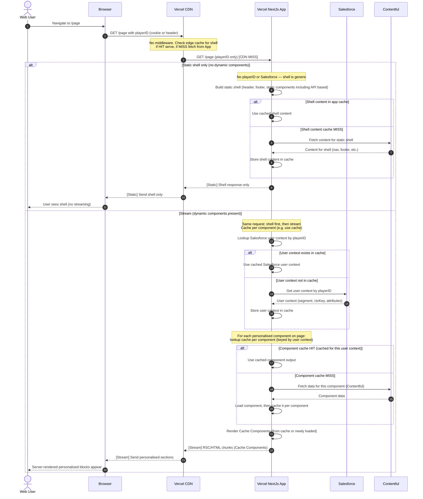

# Personalisation Approach: Full Page with Dynamic Cache Components (No Middleware)

This document describes an architectural approach for personalisation using:

- **Next.js (Vercel)** for web
- **Contentful** as CMS
- **Salesforce** for user context (resolved by playerID)
- **Next.js Cache Components** (`use cache` + cache per component) and streaming for server-rendered personalisation

All components are **CMS-able** (managed in Contentful) and can be **placed anywhere** on the page. The decision of which components are **static** (part of the static shell) vs **Cache Components** (personalised, cached per user context) is made per component—e.g. via CMS configuration or component type. Only static components go in the shell (e.g. header, footer, and any components marked static); the rest are Cache Components. There is **no Edge Middleware**.

---

## 1. Clarifications

### 1.1 PlayerID and Salesforce

- The browser sends only **playerID** (e.g. in a cookie or header). No full user-context cookie is required.
- The **Next.js app** looks up **Salesforce user context** by playerID. If it exists in the app cache, it is reused; if not, the app calls Salesforce, gets user context, and caches it.
- Content is defined in **Contentful**. Personalisation rules and user context come from **Salesforce**. Per-component data is fetched from Contentful when the component cache misses.

### 1.2 Static shell vs Cache Components (CMS-able, placeable anywhere)

- **All components are CMS-able** and can be added and positioned anywhere via the CMS. The app (or CMS configuration) **decides per component** whether it is **static** or a **Cache Component** (personalised).
- **Static components:** Those marked or configured as static (e.g. header, footer, and any non-personalised blocks) are rendered in the **static shell**. No playerID or Salesforce is used for the shell; it is generic and CDN-cacheable. Shell content can be fetched from Contentful and cached with a generic key.
- **Cache Components:** Components that are configured or decided as personalised are rendered as **Cache Components**. The app looks up **cache per component** (keyed by user context). On cache miss, it loads the component (fetches from Contentful for that component) and caches it **per component**.

### 1.3 Cookies vs headers

- **playerID** can be sent via cookie or header. Header-based playerID is preferred when cookies are disabled (e.g. some users, or mobile APIs).

---

## 2. Approach: Full Page Built with Dynamic Cache Components (No Middleware)

### Summary

- **Web:** Single request (GET /page with playerID). **No middleware.** All components are CMS-able and placeable anywhere; the app **decides per component** which are static vs Cache. The app returns the **static shell first** (header, footer, and components decided as static), then **streams** RSC chunks for **Cache Components** (components decided as personalised) on the same response.
- **Flow:** Browser → CDN → App. Static shell: no playerID or Salesforce; shell content from app cache or Contentful. Stream: lookup Salesforce user context by playerID (cache or SF); for each component decided as personalised, lookup cache per component (keyed by user context); on miss, fetch from Contentful and cache per component.
- **Response:** Same HTTP response: shell first, then streamed RSC/HTML chunks. Full page is built from static shell + dynamic Cache Components.
- **Mobile:** Same pattern with playerID in header; no middleware.

### Pros

- **1:1 personalisation** for all non-shell components, with **per-component cache** keyed by user context (fine-grained reuse).
- **No middleware:** Simpler edge; no rewrite logic; playerID is the only identifier from the client.
- **Static shell is generic:** CDN-cacheable without variant routes; no playerID or Salesforce for shell.
- **Good performance:** Shell from CDN when cached; streaming keeps TTFB low; component cache reduces Contentful and Salesforce calls.
- **Cookie-optional:** playerID can be sent via header for users who disable cookies.
- **Single place for logic:** Next.js app (Server Components + Contentful + Salesforce); no middleware personalisation.

### Cons

- **Component cache cardinality:** Cache keys are per component × user context; many users/components can increase cache surface (bounded by cache lifecycle and eviction).
- **Streaming and caching:** Requires correct use of Cache Components, per-component cache keys, and cache lifecycle.
- **Two response modes:** Static shell only vs shell + stream; behaviour depends on whether the page has dynamic components.
- **No BFF:** App talks to Contentful and Salesforce directly; mobile-specific aggregation would need a separate layer if required.

---

## 3. Web flow (sequence diagram)

The following sequence diagram shows the web flow: single request with playerID, CDN cache check for shell, then either static shell only or shell + stream (Salesforce user context, per-component cache, Contentful on miss).

**Flow summary:** Browser → CDN (check edge cache; on MISS → App). App: static shell (no playerID/Salesforce; Contentful for shell content on app-cache miss) or shell + stream (user context by playerID from cache or Salesforce; per-component cache; Contentful for each component on cache miss). Same response: shell first, then RSC chunks.

See also the step-by-step summary in **[Scenario 13: playerID → Salesforce → Cache Components – Sequence diagram](./scenario-13-playerid-salesforce-cache-sequence.md)**.

---

## 4. Table of comparison (positioning)

| Category | This approach (Full page, dynamic Cache Components, no middleware) |
|----------|-------------------------------------------------------------------|
| **1:1 personalisation** | Yes (all non-shell components; cache per component keyed by user context) |
| **Build model** | Static shell (generic) + on-demand stream of Cache Components |
| **Performance** | Strong: CDN-cached generic shell; streaming; per-component cache reduces origin calls |
| **Scalability under traffic** | High: CDN absorbs shell; compute for stream and cache misses only |
| **Risk of cache explosion** | Medium (per component × user context; bounded by cache lifecycle) |
| **Middleware processing** | None |
| **Solution complexity** | Medium (Cache Components, per-component cache keys, Salesforce + Contentful) |
| **Vercel cost** | Medium (no middleware; serverless for App; CDN for shell) |
| **Best for** | Full-page personalisation with playerID only; cookie-optional; static shell + dynamic Cache Components |

---

## 5. Technical solution: build guide (handover to devs)

Simple step-by-step implementation for developers.

### 1. Reading playerID (cookie)

- Set a cookie after login with the playerID.
- In Server Components and server code, read playerID from the request from the cookie.
- Static shell must not use playerID: layout, header, footer, and any static components must not read playerID or any user-specific data so the shell stays generic and CDN-cacheable.

### 2. Page request

#### 2.1 Static shell

- No middleware logic required.
- Static shell should include header, footer, static components (e.g. components that will never be personalised, like breadcrumbs) or API-based components (e.g. any component that gets data from Mule).
- Load static shell components on the page by grabbing content from Contentful.
- Static shell components will not use "use cache" or Suspense.
- Send the static shell back when all of these components have been rendered.

#### 2.2 Stream (personalised components)

- Start a stream for components that require personalisation.
- All components that are allowed to do personalisation will be part of this stream.
- Read playerID (from cookie) only when rendering the stream; do not use playerID in the static shell.
- For the stream: get user context by playerID (from app cache or by calling Salesforce); then for each personalised component, look up cache per component (keyed by user context); on cache miss, fetch from Contentful and cache per component.
- Use Suspense around each personalised block so the shell is sent first and RSC chunks for each block stream after on the same response.

### 3. User context (Salesforce)

- When handling the stream, resolve user context by playerID.
- If user context exists in app cache (keyed by playerID), use it.
- If not, call Salesforce with playerID, get user context (e.g. segment, ctxKey), store in cache, then use it.
- Use this only in the stream path; never in the static shell.

### 4. Cache Components (in the stream)

- Each component that is allowed personalisation is a Cache Component in the stream.
- Cache key must include user context (e.g. ctxKey or segment) so cache is per user-context.
- On cache miss: fetch that component’s data from Contentful (by variant from user context), then cache the result per component.
- Set a cache lifetime or revalidate so component cache does not grow unbounded.

### 5. Caching summary

- Static shell: CDN-cacheable; no playerID in cache key.
- Shell content from Contentful: cache with a generic key (e.g. shell or locale); revalidate as needed.
- User context: cache by playerID; TTL (e.g. 5–15 min) or invalidate on logout.
- Component output: cache by component id + user context; use cache lifetime or revalidate.

### 6. Checklist for devs

- [ ] playerID set in cookie after login; read from cookie in server code only for the stream; static shell never uses playerID.
- [ ] Static shell: header, footer, static/API-based components; content from Contentful; no "use cache" or Suspense; send when all rendered.
- [ ] Stream: components that require personalisation; read playerID, get user context (cache or Salesforce), render Cache Components; Suspense so shell first, then stream.
- [ ] User context: cache by playerID; call Salesforce on miss; use only in stream.
- [ ] Cache Components: cache key includes user context; Contentful on miss; cache per component; revalidate/cache lifetime set.
- [ ] Decision rule for which components are static vs personalised (e.g. CMS or component type).

---

## 6. Development steps (Jira-style, in order)

Step-by-step tickets for development. No code; brief scope only. Execute in order.

| # | Ticket | Scope |
|---|--------|--------|
| 1 | **Set up env and config** | Add env vars for Contentful, Salesforce, and playerID cookie name. Confirm Next.js App Router and streaming. No middleware. |
| 2 | **Define static vs personalised** | Decide and document which components are static (shell) vs personalised (stream). E.g. CMS flag or component type. |
| 3 | **Set playerID cookie at login** | After login, set a cookie with the playerID. Ensure it is available on subsequent page requests. |
| 4 | **Read playerID in server (stream only)** | Implement reading playerID from the cookie in server code. Used only when rendering the stream; never in layout or static shell. |
| 5 | **Static shell: layout and structure** | Root layout renders only static content (header, footer). No playerID, no user context. Shell is CDN-cacheable. |
| 6 | **Static shell: load from Contentful** | Load header, footer, and static components (e.g. breadcrumbs, API-based blocks) from Contentful. No "use cache" or Suspense in shell. |
| 7 | **Static shell: send when ready** | Return the static shell to the client only after all static components have been rendered. |
| 8 | **User context service** | Implement service: input playerID; return user context (e.g. segment, ctxKey). Use app cache keyed by playerID; on miss call Salesforce and cache. Use only in stream path. |
| 9 | **Stream: start and read playerID** | Start the stream for personalised components. Read playerID and get user context (cache or Salesforce) inside the stream only. |
| 10 | **Stream: Cache Components** | Each personalised component is a Cache Component. Cache key includes user context. On miss fetch from Contentful and cache per component. Wrap in Suspense so shell sends first, then stream. |
| 11 | **Cache lifecycle** | Set cache TTL/revalidate for: shell content (generic key), user context (by playerID), and Cache Components (by component + user context). |
| 12 | **Page composition from CMS** | Resolve page structure from CMS; place components by static vs personalised; render static shell first, then streamed personalised blocks. |
| 13 | **Verify and test** | Confirm static shell never uses playerID; shell returns first then stream; cache hit/miss behaviour for user context and components. |

---

## 7. Related docs

- **[Scenario 13: playerID → Salesforce → Cache Components – Sequence diagram](./scenario-13-playerid-salesforce-cache-sequence.md)** — Full sequence diagram and step-by-step summary.
- **[Personalisation Approach: Middleware + Cache Components](./personalisation-approach-middleware-cache-components.md)** — Alternative approach with middleware and cookie-based context.
- [Next.js Cache Components](https://nextjs.org/docs/app/getting-started/cache-components) — Official docs for use cache and cache lifecycle.
