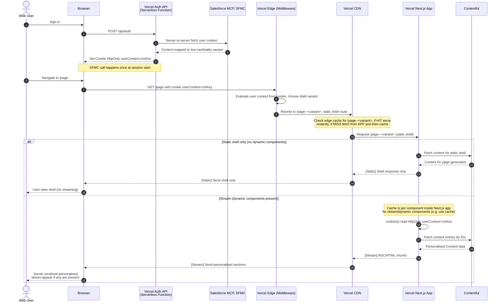

# Scenario 12: Cache Components – Sequence diagram

**Middleware routing with Cache Components for 1:1 personalisation**

Scenario 12 uses the **cookie read in App** for personalised data; **Vercel Edge Middleware** runs before the CDN to evaluate the user-context cookie and rewrite to a variant route. Next.js 16 **Cache Components** (`use cache` + `cacheLife`) for shared content and **Suspense** for personalised content. **Salesforce is called once at login** (set-user), ctxKey/segment is stored in a cookie, and the **Next.js app** reads the cookie inside a dynamic component (inside `<Suspense>`), then fetches Contentful entries by variant. No middleware, no Salesforce call on page load.

**Note:** The RSC / Cache store lives on **Vercel Origin** (with Serverless). It is not the same as Vercel CDN cache (edge).

**No BFF:** The Next.js app calls Contentful directly. ctxKey/segment comes from the cookie set at login. Request path: **Browser → Edge Middleware → CDN → App**.

---

## Sequence diagram (Scenario 12 flow)

**Flow:** Login → Salesforce once → cookie (ctxKey/segment). Page request → **Edge Middleware first** (Vercel) → CDN → App. Middleware evaluates cookie and rewrites to variant route; CDN then serves or fetches from App. App: static shell, Cache Components, then dynamic component reads `cookies()` and fetches Contentful by variant.

**Full approach doc:** [Personalisation Approach: Middleware Routing with Cache Components](./personalisation-approach-middleware-cache-components.md).

This matches the [Next.js Cache Components](https://nextjs.org/docs/app/getting-started/cache-components) pattern: static shell, `use cache` for shared/cached content, and a component that reads `cookies()` wrapped in `<Suspense>` for personalised content.

---

## Summary

| Step | What happens |
|------|----------------|
| **Login (set-user)** | User picks email → Auth/set-user calls Salesforce once → segment/ctxKey stored in cookie. No middleware. |
| **Page request** | GET /page with cookie → **Edge Middleware** (evaluate cookie, rewrite to /page--&lt;variant&gt;) → CDN → App. |
| **Cached block** | `use cache` lookup, no cookie. MISS → fetch Contentful cached, cache. HIT → reuse. |
| **Personalised block** | Dynamic component (Suspense): `cookies()` → read segment/ctxKey, fetch Contentful entries?segment=… No Salesforce on page. |
| **Response** | Shell first, then cached block, then streamed personalised section. |

Salesforce runs **once at login**. The cookie carries **ctxKey/segment**. Edge Middleware runs before the CDN and rewrites to the variant route; the app reads the cookie via `cookies()` inside the dynamic component. Contentful cached block is shared, Contentful entries are fetched by variant from cookie.
