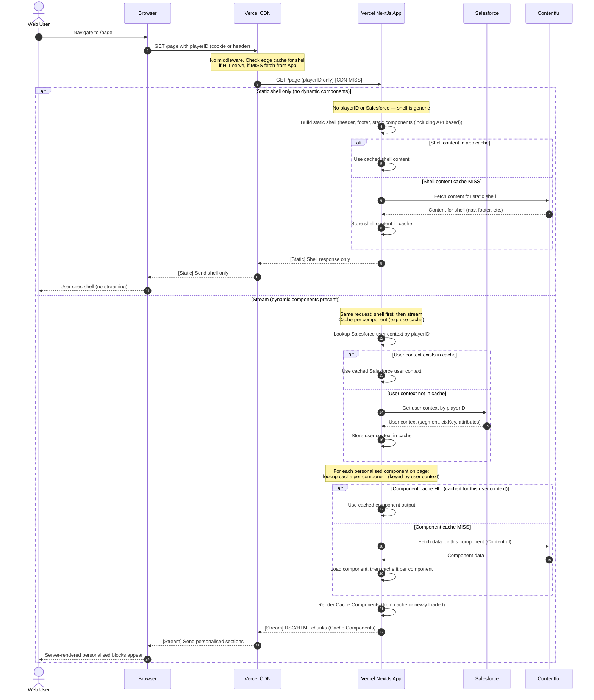

# Scenario 13: playerID → Salesforce → Cache Components – Sequence diagram

**No middleware. Browser sends only playerID. Next.js resolves user context from Salesforce, caches it, and uses it for Cache Components.**

In this flow there is **no Edge Middleware**. The browser sends a **single request** (GET /page with playerID in cookie or header). The app responds on that **same request**: first the **static shell** (header, footer, static components (including API based); **no playerID or Salesforce**), then **streamed RSC chunks** for personalised Cache Components. When building the stream, the app: (1) looks up **Salesforce user context** by playerID (use if cached, else call Salesforce and cache); (2) for each personalised component on the page, looks up **cache per component** (keyed by user context); if a component is not in cache, the app loads it (calls Contentful for that component’s data) and then caches it **per component**.

**Note:** The RSC / Cache store lives on **Vercel Origin** (Serverless). CDN can still cache the static shell; personalised Cache Components are filled using the app’s cached user-context data.

**Request path:** **Browser → CDN → App** (no middleware).

---

## Sequence diagram (Scenario 13 flow)

**Flow:** Single request: GET /page with playerID → CDN → App. App returns **static shell first**, then **streams** RSC chunks. For the stream: lookup **Salesforce user context** (cache or SF call); then for each component, lookup **cache per component** (keyed by user context); on component cache MISS, load component (Contentful) and cache per component. No middleware.

---

## Summary

| Step | What happens |
|------|----------------|
| **Page request** | Browser sends **one** GET /page with playerID. No middleware. **CDN** checks edge cache for shell; if **MISS**, request goes to **App**. |
| **Static shell** | No **playerID** or **Salesforce** — the shell is generic (header, footer, static components (including API based)). When CDN misses, App builds the shell. If shell content is not in app cache, App fetches from **Contentful** (nav, footer, etc.) and caches it. Returns shell to CDN and browser. |
| **Stream (same response)** | If the page has dynamic components, App **continues the same response** with streamed RSC chunks. Not a second browser request. |
| **Salesforce user context** | App looks for **Salesforce user context** by playerID. If it **exists in cache** → use it. If **not** → call **Salesforce**, get user context, store in cache. |
| **Per-component cache** | Using that user context, App looks at **cache for each individual component** on the page (keyed by user context). If **component cache doesn’t exist** → load component (call **Contentful** for that component’s data) → **cache it per component**. |
| **Stream chunks** | App renders Cache Components (from cache or newly loaded) and sends RSC/HTML chunks. Personalised sections stream in after the shell. |

**Difference from Scenario 12:** Scenario 12 uses **middleware** (cookie with ctxKey/segment, rewrite to variant route). Scenario 13 uses **no middleware**; the browser sends only **playerID**; the **Next.js app** is responsible for calling Salesforce, caching user context by playerID, and reusing that cache for building dynamic Cache Components. Static shell stays generic (header, footer, static components (including API based)); only the personalised sections depend on the cached context.

---

## Related docs

- **[Scenario 12: Cache Components – Sequence diagram](./scenario-12-cache-components-sequence.md)** — Middleware + cookie (ctxKey/segment) flow.
- **[Personalisation Approach: Middleware + Cache Components](./personalisation-approach-middleware-cache-components.md)** — Approach that uses middleware and cookie-based context.
